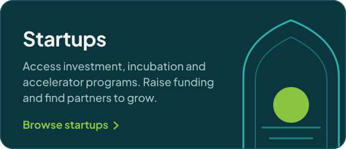
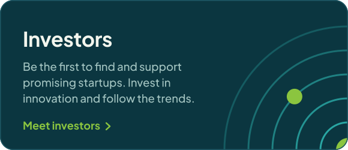
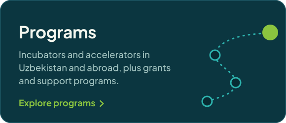
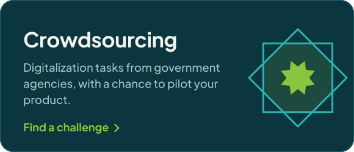
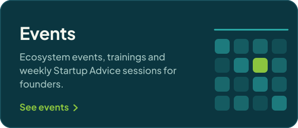
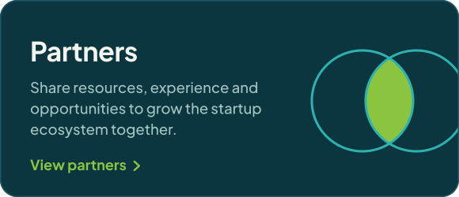
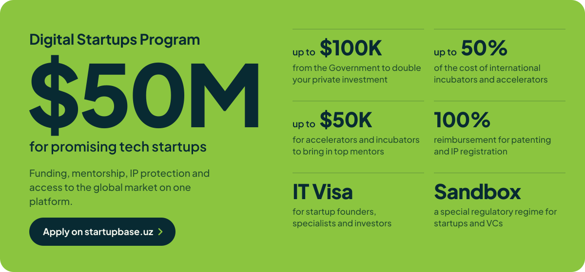

  

  
  
  
  
  

StartupBase brings together promising startups, their founders, partners and investors in Uzbekistan's innovation ecosystem. Register your startup, find investors and programs, and keep up with events across the country.

  
  
  
  
  
  

  

  

<!-- TELEGRAM:START -->
- `09 Oct` [🇺🇸 15 ta o‘zbek startapi — AQSh bozori sari](https://t.me/startupbaseuz/9227)
- `09 Oct` [🌐 O‘zbekiston startap ekotizimi: keyingi bosqich nimaga bog‘liq?](https://t.me/startupbaseuz/9226)
- `09 Oct` [🇮🇩 Digital Uzbekistan: Indonesia 2026 — O‘zbekiston startaplari Indoneziya bozorida yangi hamkorliklarni yo‘lga…](https://t.me/startupbaseuz/9220)
- `09 Oct` [🇹🇲 IT Park rezidentlari va startaplari uchun Turkmaniston bozoriga chiqish imkoniyatlari muhokama qilindi](https://t.me/startupbaseuz/9216)
- `09 Oct` [🚀 Andijonlik yoshlar startaplariga investitsiya jalb qilishni o‘rgandi](https://t.me/startupbaseuz/9206)
<!-- TELEGRAM:END -->

Have a question? Write to <a href="mailto:info@startupbase.uz">info@startupbase.uz</a>

